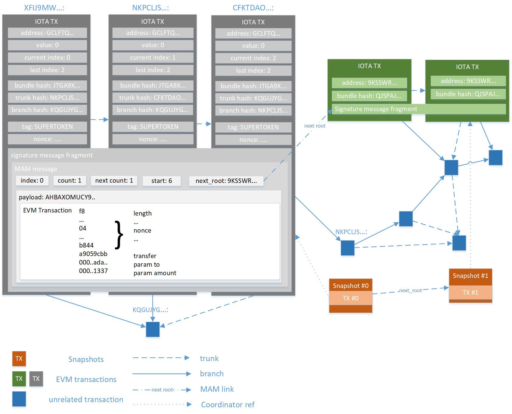
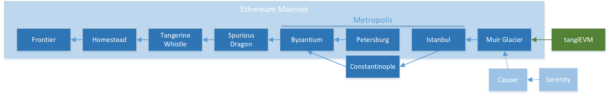
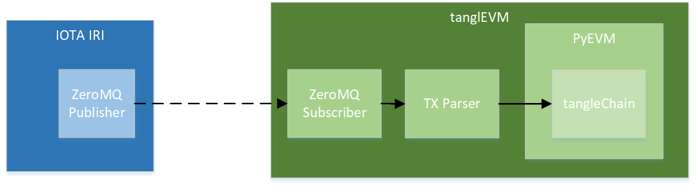

The TanglEVM project
====================



is a proof-of-concept smart contract platform based on the EVM engine (as that is still
the de-facto standard for smart contracts), that builds a separate sidechain for each
DApp and uses the DAG ledger of IOTA – the Tangle – as storage layer. 

EVM Transactions can be published in a public masked authenticated messaging stream,
and the TanglEVM daemon will listen to those messages, and verify and execute them.

This was developed as part of a [Master thesis](docs/thesis.pdf) (see the [poster](docs/poster.pdf)
for a short summary) at the Faculty of Informatics at the TU Wien.

TanglEVM
--------

implements a fork of the EVM (Ethereum Virtual Machine), based on the Muir Glacier hard fork.



It provides helper functions to deal with the conversion between trytes and bytes, and extends 
the database format to also store relevant attributes for IOTA (in particular the MAM channel 
IDs).

As another proof-of-concept, a custom opcode (0xe0) - unused in the Petersburg fork - is 
implemented, which performs a `CURL` hashing function on its arguments.


Demo
----

The demos build IOTA MAM streams, which encode EVM contract creations and contract
calls.

They are never actually sent to the network - only created and then immediately 
parsed by the TX Parser. The EVM database is only stored in memory.

```
python demo_supertoken.py
```

fakes the creation of a ERC20 token contract ([SuperToken.sol](contracts/SuperToken.sol)), and the transfer of a specified amount of tokens to 
another address.

To verify the contract calls worked, the total token supply (10000 SUP, 18 decimals) and the balance of the transfer recipient is read from the storage.

```
python demo_curl_opcode.py
```

demoes the implemented `CURL` opcode by deploying a contract implementing a `myhash(bytes memory data) public pure returns (bytes32, bytes32)` function.

The contract was created by modifying the bytecode of the [TwoValues.sol](contracts/TwoValues.sol) contract, to use the `CURL` (0xe0) opcode.

It returns two bytes32 strings, as the byte-encoded hash does not fit into
a single value.

Prerequisites
-------------

- IOTA IRI node with exposed ZeroMQ port and IRI API

A private IOTA testnet started via Docker ([one-command-tangle](https://github.com/iota-community/one-command-tangle)) is recommended, [one-command-tangle-docker-compose.yml](one-command-tangle-docker-compose.yml) shows how IRI can be started to expose the ZeroMQ interface. 

Daemon
------



```
TAG=TANGLEVMTESTAAAA python daemon.py
```

The daemon listens to all IOTA transactions, and when they match the specified the tag, verifies it contains a valid MAM message, which in turn has a valid EVM message as payload.

If it does, the transaction is executed, and stored in the blockchain database (chain.leveldb).

It also mines an EVM block every 20 seconds (publishing the block in the Tangle - similar to an IOTA milestone - is still missing).

Publishing transactions
-----------------------

Transactions can be sent to the Tangle via the `send.py` script.

Usage:

```
python send.py <seed> <tag> <state-file> <nonce> <to address> <data>
```

As an example, the following call deploys the SuperToken contract in the namespace/sidechain TANGLEVMTESTAAAA:

```
python send.py BCRPJHFFYZCPXNDGOVKKOXCMOUNRJXAYBEWRDLOOEBRZXSLHQCRAUCZ9JHJNUGTIBS99VCSSMEXYKAAAA TANGLEVMTESTAAAA BCRPAAA.json 0 _ $(cat contracts/SuperToken/SuperToken.bin)
```

The special value `_` denotes the empty CREATE_CONTRACT address.

The MAM state is stored in the file BCRPAAA.json.

To transfer tokens to another address (0xada5547578a08c7d991811c83616b7f3ed33b795),
the following invocation can be used:

```
python send.py BCRPJHFFYZCPXNDGOVKKOXCMOUNRJXAYBEWRDLOOEBRZXSLHQCRAUCZ9JHJNUGTIBS99VCSSMEXYKAAAA TANGLEVMTESTAAAA BCRPAAA.json 1 0x4330096e5ec0113e4fda9feb09bc0fa773fdd96c a9059cbb000000000000000000000000ada5547578a08c7d991811c83616b7f3ed33b7950000000000000000000000000000000000000000000000000000000000001337 
```

Security
--------

None. This is a prototype, which is susceptible to various attacks.
